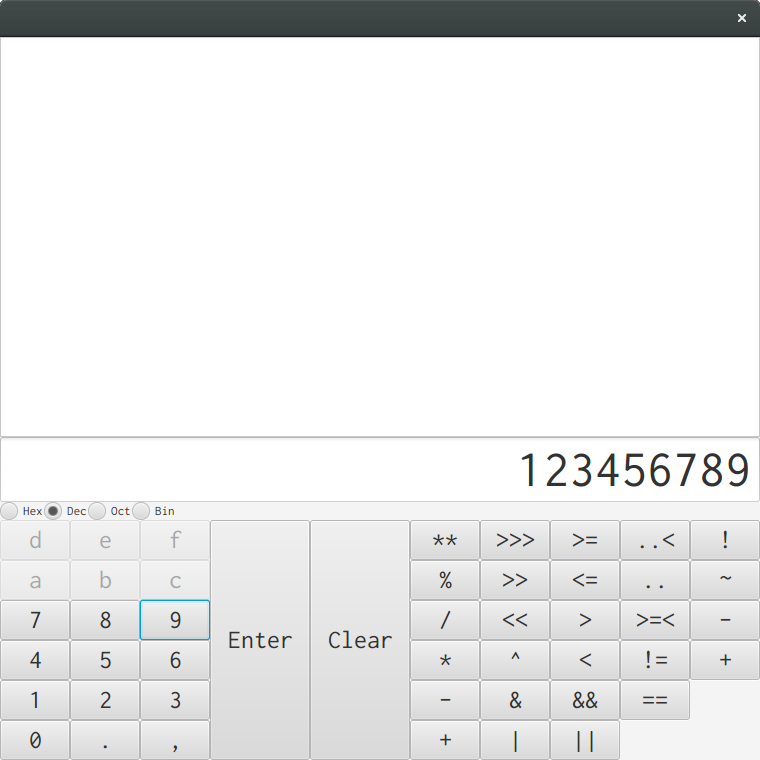
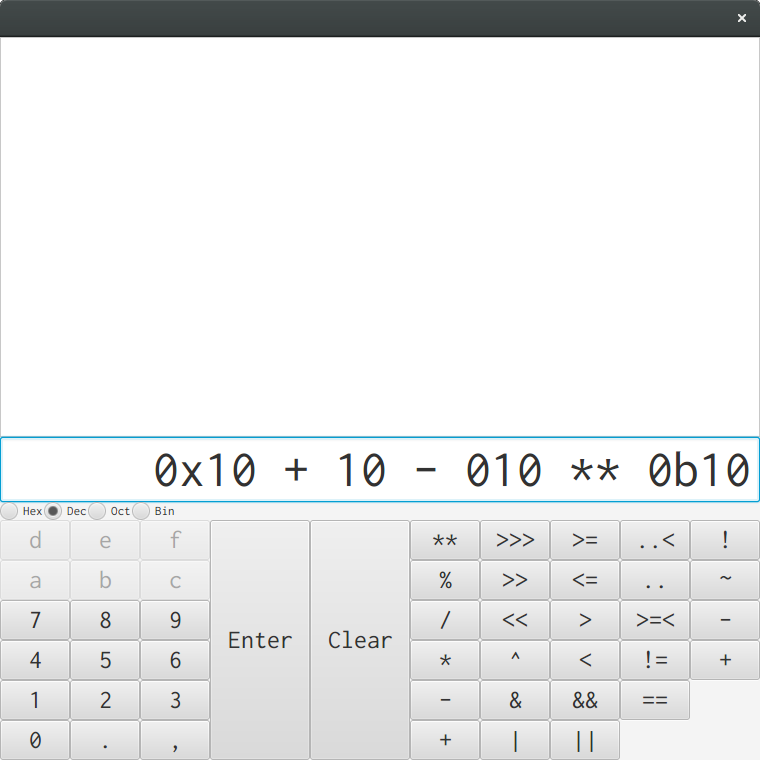

# 問題1 GUIの設計

Swingは将来的に廃止されるので,その後継のJavaFXを学習するために,JavaFXで書くことにしました.

GUIの見た目を提示します.

## マニュアル

0. ボタンを押して数式を構成する
1. Enterボタンを押して数式を評価する
2. 上部領域に数式とその結果が表示される
3. 数式を入力して基数ボタンを押して基数モードを切り替えると,数値がその基数に変換される

## GUIの構築

### FXML

JavaFXでは基本的にXMLベースのFXMLファイルにUI定義を記述します.

FXMLは普通Scene Editorなどのグラフィカルなツールで書くもので,手書きするのはただの苦行のようですが,ここは学習のためにあえてFXMLを手書きしました.

### CSS

FXMLにはCSSを適用することが出来ます.

### Java

読み込みと描画をするだけならJava側のプログラムはほとんど書く必要はありません.

~~~java
import java.io.*;
import javafx.application.*;
import javafx.fxml.*;
import javafx.scene.*;
import javafx.stage.*;

public class RadixConv extends Application {
    public static void main(final String[] args) {
        launch(args);
    }
    @Override
    public void start(final Stage stage) throws IOException {
        stage.setScene(new Scene(FXMLLoader.load(getClass().getResource("RadixConv.fxml"))));
        stage.show();
    }
}
~~~

## JavaFXについての考察

結論:色々問題はあるが,Swingよりは良い

### FXMLは単にクラスを並べただけ

しかしこのFXML,XMLベースで作成する必要があったのか大いに疑問があります.

なぜなら,FXMLはVBoxやHBoxなどで,構造ではなくレイアウトを記述しています.

普通,HTMLやXMLは構造を記述するもので,レイアウトを定義するものではありません.

そしてFXMLもCSSが使えるので,当然FXMLではレイアウトの意味を持たせないと予想するでしょう.

しかし,FXMLはパネルがレイアウトの意味を持っているものしか無く,どうも初めからレイアウトの意味を含むように作られたようなので,XML部分にレイアウトの意味を含ませないようにするのは不可能です.

QMLほど見た目が離れていればあまり気になりませんが,XMLなのにレイアウトを定義するというのはETMLを見ているような気持ち悪さがあります.

JavaFXはリッチインターネットアプリケーションライブラリだとか言われていますが,FXMLはWebを参考にしたとかそういうことは全く無く,FXMLは単にJavaFXのクラスを並べただけ,と考えたほうがスムーズに開発が出来ます.

それと,やはりFXMLを手で書くのはただの苦行です,誰も得しません.
FXMLは構造化を全然行わないので手で書いても別に綺麗になったりしません.
素直にGUIのツールを使うべきでした.

### CSSが貧弱

JavaFXのCSSの対応は非常に貧弱で,WebのようにCSSでレイアウトするのは無理です.

具体的にどう貧弱かというと,

* セレクタが貧弱, :before, :after, :nth-childなどに非対応
* lengthが貧弱, px, pt, などしかなく, vwやvhなどに非対応,パーセントの指定がWebのようには動かない
* プロパティが貧弱, flexboxなどもちろんなく, marginすらありません(paddingはある)

CSSには一切期待しないほうが良いです.

### WebView

ところで,JavaFXではWebViewやWebEngineを使ってHTMLを処理することができるそうで,
そのレンダリングエンジンはWebKitだそうです.

これを使おうかと少し検討しましたが,以下の理由で今回は使いません.

* 一年前の情報表現演習の総合課題でjQueryで電卓を実装したことを思い出した
* どうせWebベースなら,JavaごとやめてElectronやQtを使いたい
* Javaを投げ捨てるならともかく,マトモに書こうとして調べまわるのに2日かかったFXMLを投げ捨てるのは非常につらい

既存のJavaソフトウェアのフロントエンドを書くが,UIは普通にHTML+CSSで書きたい,という人には良い選択肢なのではないでしょうか.

# 問題2 ActionListener

当たり前ですが,SwingとJavaFXではいろいろ異なるので,異なる方法で実装します.

JavaFXでのアクションリスナーを書くには,複数の方法があります.

0. JavaScriptが使えるので,Javaのことは忘却してJavaScriptで書く.`onAction`属性でWebのように指定できる
1. Javaクラスにメソッドを書き,FXML側で`fx:controller`にそのJavaクラスを指定することで,`onAction`属性にそのJavaクラスのメソッドが指定できる
2. コントローラを指定して`@FXML Label labelId`のようにフィールドを書くと,指定のIdの要素が取り出せるので,Java側で`setOnAction`する.

JavaもJavaScriptも,実行前チェックがあんまり役に立たないという点において,あまり大差は無いのですが,Groovyで数式を処理する予定なので,Javaで書くことにします.

FXMLをWebのように書くのは無理とは言え,やはり`onAction`属性を指定していくというのは気持ち悪いので,Java側クラスに変数をバインディングします.

## 値ボタンが押されたときの機能

内容を加えるラムダ式をアクションに指定する.

promptText(Web的に言うとplaceholder)を設定しているので,なにか特別なことをする必要はありません.

~~~java
    @FXML
    public void initialize(final URL location, final ResourceBundle resources) {
        this.inserter.lookupAll(".number").stream().forEach(b -> ((Button)b).setOnAction(evt -> inputLine.appendText(((Button)b).getText())));
    }
~~~

# 問題3 基数の変換

基数関連の機能をまとめる列挙型`Radix`を定義して,変換やプレフィクス付けを行います.

プレフィクスの追加や削除は正規表現で行います.

Javaの正規表現は先読み後読みがあり,かなり強力です.

真面目に設計するならば,｢基数付きの数｣クラスを定義するべきでしょうが,そこまでやるならばパーサを書きます.

~~~java
enum Radix {
    Bin(0b10, "0b", "((?<=(^| ))0b[0-1]+)"),
    Oct(010,  "0",  "((?<=(^| ))0[0-7]+)"),
    Dec(10,   "",   "((?<=(^| ))[1-9][0-9]+)"),
    Hex(0x10, "0x", "((?<=(^| ))0x[0-9a-f]+)");

    Radix(final Integer radix, final String prefix, final String pattern) {
        this.radix = radix;
        this.prefix = prefix;
        this.pattern = Pattern.compile(pattern);
    }

    public static String fmapWithRadix(final Radix fromR, final Radix toR, final String view) {
        return Integer.toString(Integer.parseInt(removePrefix(view), fromR.radix), toR.radix);
    }

    public static String removePrefix(final String withPrefix) {
        final Pattern p = Pattern.compile("^0[bx]?");
        return p.matcher(withPrefix).replaceAll("");
    }

    public static String replaceNumber(String line, final Radix toR) {
        for(Radix r : Radix.values()) {
            final Matcher m = r.pattern.matcher(line);
            final StringBuffer b = new StringBuffer();
            while(m.find()) {
                m.appendReplacement(b, toR.prefix + Integer.toString(Integer.parseInt(Radix.removePrefix(m.group()), r.radix), toR.radix));
            }
            line = m.appendTail(b).toString();
        }
        return line;
    }
    public Integer radix;
    public String  prefix;
    public Pattern pattern;
}
~~~

`this.radix.selectedToggleProperty().addListener`に指定したメソッドに古い値`oldValue`と新しい値`newValue`を送ってくれるので,
それに従って変換しようかと思いましたが,全ての数値にリテラルプレフィクスがついているので,`newVaule`だけ見れば問題ありません.

~~~java
    @FXML
    public void initialize(final URL location, final ResourceBundle resources) {
        this.inserter.lookupAll(".number").stream().forEach(b -> ((Button)b).setOnAction(evt -> appendNumber(((Button)b).getText())));

        this.radix.selectedToggleProperty().addListener(this::toggleRadix);
        this.radix.selectToggle(radixDefault);
    }

    public void appendNumber(final String numberText) {
        final String line = this.inputLine.getText();
        if(line == null || line.equals("") || line.endsWith(" ")) {
            this.inputLine.appendText(Radix.valueOf(((RadioButton)this.radix.getSelectedToggle()).getText()).prefix);
        }
        this.inputLine.appendText(numberText);
    }

    private void toggleRadix(final ObservableValue<? extends Toggle> obs, final Toggle oldValue, final Toggle newValue) {
        final Radix newRadix = Radix.valueOf(((RadioButton)newValue).getText());
        this.disableButtonFromRadix(newRadix);
        this.inputLine.setText(Radix.replaceNumber(this.inputLine.getText(), newRadix));
    }

    private void disableButtonFromRadix(final Radix radix) {
        final Set<Node> buttons = this.inserter.lookupAll(".number");
        buttons.stream().forEach(b -> ((Button)b).setDisable(true));
        buttons.stream().filter(b -> Integer.parseInt(((Button)b).getText(), 16) < radix.radix).
            forEach(b -> ((Button)b).setDisable(false));
    }
~~~

# 問題4 機能を追加する

Javaとの接続が簡単なGroovyのコードを構築して**Eval**します.

Groovyは関数呼び出しに括弧がいらなかったり,普通に演算子オーバーロードが出来て同値判定に`==`が使える言語なので,こういった簡易な数式評価に向いています.
あるいはJavaScriptよりもLightWeightかもしれません.

Groovyを組み込むことで,おおよそ関数電卓で行えるような計算は全て可能です.

普通は`log`を計算するのに`Math.log 10`などと入力する必要があるのですが,Groovyに渡すコードに`import static java.lang.Math.*;`を追加することにより,単に`log 10`で計算できます.

数式にエラーがあった場合,例外がログに出現します.

別に`log`や`fact`などのボタンも追加できるんですが,ただボタンを追加するだけなので,別に技術的に面白いことはないのでやめました.
そもそも,キーボードという優れた入力インターフェイスを持つPCで厳しいハードウェアの制限で作られた電卓のインターフェイスを再現することはあまりにも無意味で,
`log`とか使いたい人にはキーボードで入力してもらうか,無意味なPC上の電卓を捨てて,何らかのREPLを使ったほうが幸せになれるでしょう.
私のオススメは任意の底のlogを計算する`logBase`関数があるHaskellのREPL,ghciです.

# 問題5 JARファイルの作成

Eclipseは自動化が難しいので,ターミナルでjarを作成します.

Groovyのjarファイルを実行時に読み込む必要があるので,まずマニフェストファイルを作成します.

コンパイルして`jar`コマンドでjarアーカイブを作成します.

実行時には,`groovy.jar`も同じディレクトリに置く必要があります.

少なくとも端末室のPCでは検証しました.

One-Jarなどを使えばjarに同梱出来るようですが,それをやるならちゃんとmavenなどの設定をする必要があるでしょうし,私はこういったツールが好きではなく,同梱するのではなくパッケージ管理システムが依存関係を解決するべきだと考えています.

何でもかんでも同梱して,まともに依存関係を書かないとビルドが非常に困難になるからです.
こういった悪習が広まった結果,Java関係のソフトウェアはやたらとビルドが難しいことを私は実感しています.
そもそもgroovyを自分でビルドするのが不可能でした.

# 問題6 オブジェクト指向およびマルチスレッドプログラミング

## オブジェクト指向(バズワード)

オブジェクト指向という言葉はあまりにも乱用され,その定義は誰にもわからなくなってしまいましたが,少なくとも｢**オブジェクト**｣が｢状態を持っている｣ことは確かです.

## メモリ共有は時代遅れ

もはや｢メモリ共有｣によるマルチスレッドプログラミングは時代遅れです.

メモリ(変数)を安全に共有することは,常人には不可能です.

### メソッドは単なる関数

**メソッド**は問題を解決しません.
Simula系のオブジェクト指向言語において,メソッドは関数です.
**インスタンス**は変数です.
複数のスレッドで,同じ変数を同時に読み書きすれば,悲劇が起きることは簡単に予想できます.

### ロックの手動管理には無理がある

**ロック**は問題を解決しません.全ての変数のアクセスに対して,｢この変数は共有されるか?｣とチェックして,デッドロックが生じないように,適切に**排他**制御をするなんてことは,現実的には不可能です.
標準C言語でメモリリークを防ぐぐらい不可能です.

### プロセス間通信を使えばメモリは共有されないが

プロセス間通信は問題を解決しません.プロセスは重いので大量に動かすと,パフォーマンスの問題が生じます.
求められているのは,プロセスの性質を持つ軽量なスレッドです.

## メッセージパッシングを使うべき

これからは,デフォルトのメモリ共有をやめて,本当の**メッセージ**パッジングを行うべきです.

ここで言うメッセージは,Simula系オブジェクト指向言語で言うメッセージ(単なる関数呼び出し)とは関係ありません.
Erlangの文脈でのメッセージです.

### Javaとメモリ共有とオブジェクト指向

Java標準ライブラリでは,`java.util.concurrent`パッケージの`ConcurrentHashMap`や`ConcurrentLinkedDeque`などを使うことで,擬似的にメッセージパッシングが実現できますが,Javaの変数は**スレッド**間で共有されており,それを誰が所有しているかを処理系が知ることは出来ません.

変数の共有を避けるために,Javaでメッセージを受け取る**クラス**は,メッセージを受け取る｢メールボックス｣以外に,状態を表現するフィールドを持たないことが推奨されます.

状態を持たないクラスとは,要するにただの関数のことです.

Javaでのオブジェクト指向はマルチスレッドプログラミングに向いていません.

オブジェクト指向でマルチスレッドプログラミングをするならば,変数がデフォルトでスレッドローカルな言語を使うべきです.

## 補足

**mainメソッド**は使いどころがなかったので書けませんでした.
